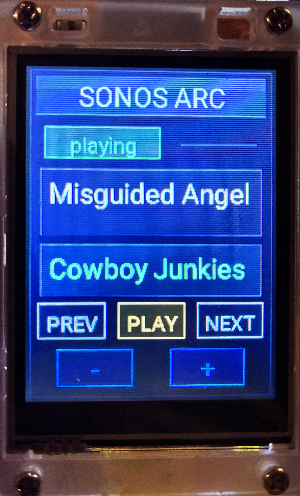

# ESP32 Sonos Touch Panel

  
  
  
  
  

  Dedicated Sonos touchscreen controller using a Sunton ESP32 display and ESPHome.

  

---

## Overview

This project implements a dedicated Sonos controller using a **Sunton ESP32-2432S028 2.8" touchscreen display** with **ESPHome** integrated into **Home Assistant**.

The panel displays:

- Sonos playback state
- Track title
- Artist name

And provides touch controls for:

- Previous track
- Play / Pause
- Next track
- Volume down
- Volume up

This repository documents the **first stable working version** of the project.

---

## Proven result

The screenshot above shows the current stable interface running on the device after installation and configuration.

Current stable status:

- display fully working
- touchscreen mapping working
- Sonos controls working
- title and artist display working
- long-title handling working
- accent handling stabilized enough for daily use

---

## Hardware

Tested with:

**Sunton ESP32-2432S028**

Features:

- ESP32 microcontroller
- 2.8" TFT display
- XPT2046 touchscreen controller
- integrated SPI display interface

---

## Software stack

- ESPHome
- Home Assistant
- ESP-IDF framework

---

## Project structure

    .
    ├── README.md
    ├── TROUBLESHOOTING.md
    ├── images
    │   └── screen.jpeg
    └── esphome
        ├── sunton-2432s028r-sonos.yaml
        └── secrets.example.yaml

---

## ESPHome configuration

Main configuration file:

    esphome/sunton-2432s028r-sonos.yaml

This file contains:

- display configuration
- touchscreen calibration
- Sonos Home Assistant integration
- Unicode text normalization
- touch button mapping

---

## Home Assistant entity

The configuration uses the Sonos entity:

    media_player.arc

If your Sonos entity has a different name, replace all occurrences of:

    media_player.arc

inside the YAML configuration.

---

## Configuration

Copy the example secrets file:

    cp esphome/secrets.example.yaml esphome/secrets.yaml

Then edit it with your WiFi credentials:

    wifi_ssid: "YOUR_WIFI"
    wifi_password: "YOUR_PASSWORD"

---

## Interface layout

Top section:

- SONOS ARC header
- playback state
- track title
- artist

Bottom section:

- PREV | PLAY | NEXT
- volume - | volume +

Touching these areas sends commands to Home Assistant.

---

## Notes

### Stable reference version

This repository represents a **stable working baseline**:

- display works correctly
- touchscreen mapping works
- Sonos commands work
- text normalization handles most metadata issues

Future improvements should build from this version.

### Unicode handling

Sonos metadata sometimes contains typographic characters such as apostrophes or accents.

The YAML includes a normalization function to reduce display artifacts.

### GPIO warnings

ESPHome may warn about strapping pins such as **GPIO12**.

This is expected on this board and does not affect normal operation.

---

## Flashing

1. Copy the YAML file to your ESPHome configuration folder:

       /config/esphome/sunton-2432s028r-sonos.yaml

2. Ensure secrets are configured.

3. Install the device from **ESPHome Builder** in Home Assistant.

---

## Git workflow

Typical workflow:

    git add .
    git commit -m "Update configuration"
    git push

---

## Roadmap

Planned future improvements:

- screen sleep mode
- wake on touch
- refined UI polish
- optional volume indicator
- optional LVGL version later

At this stage, no further functional changes are required for the stable version.

---

## License

MIT
